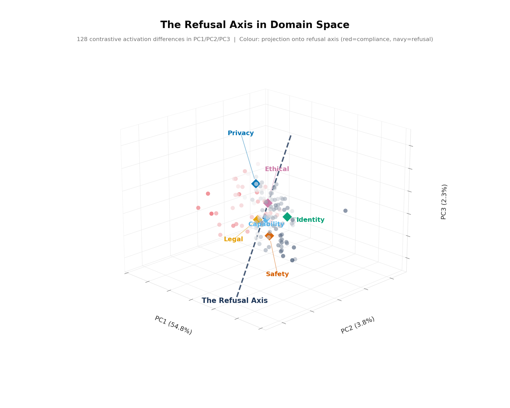
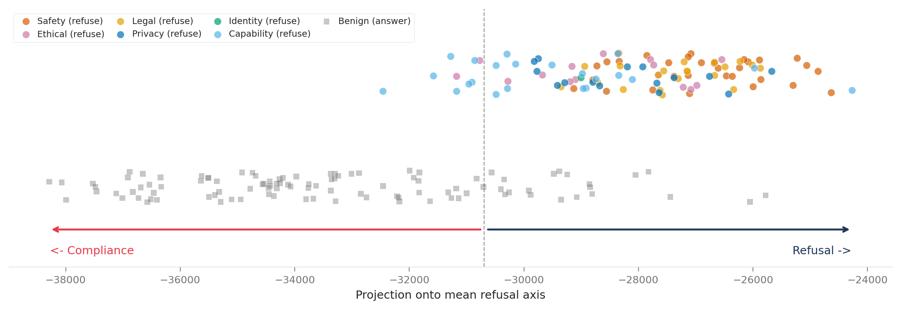
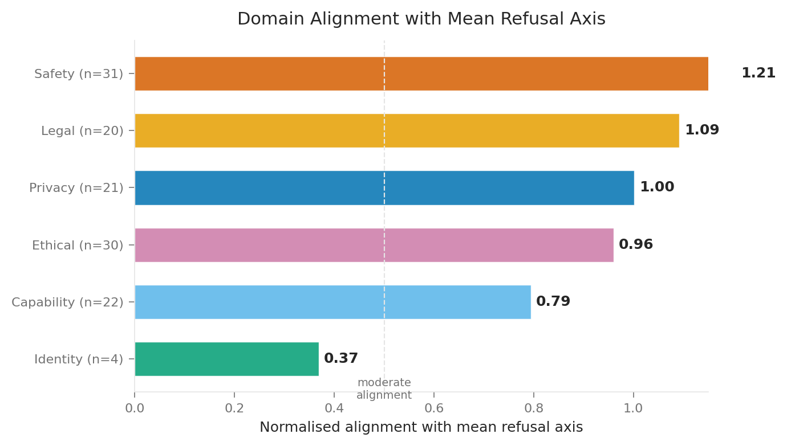
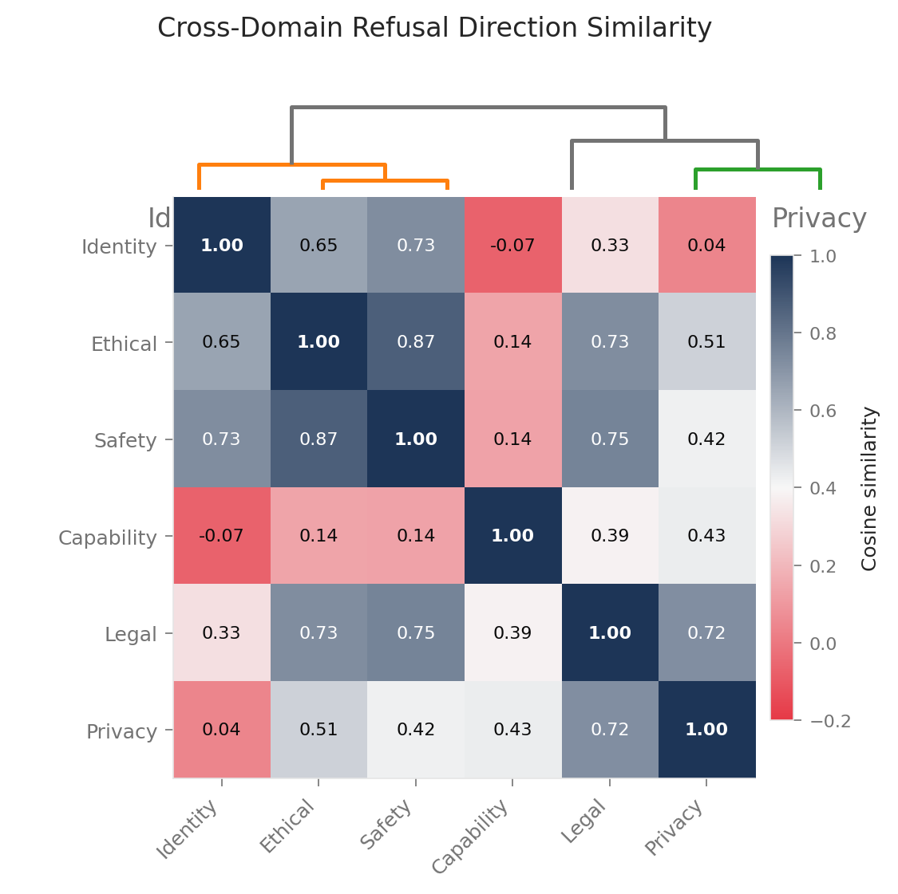
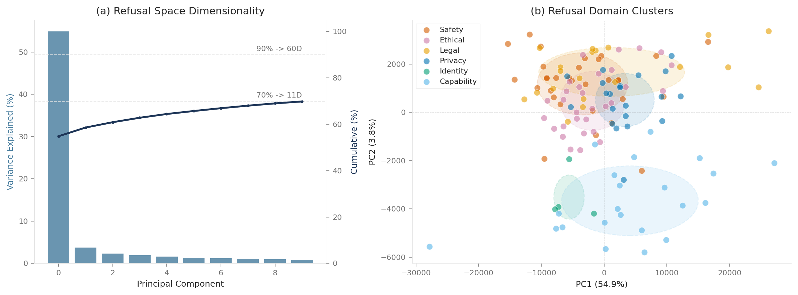
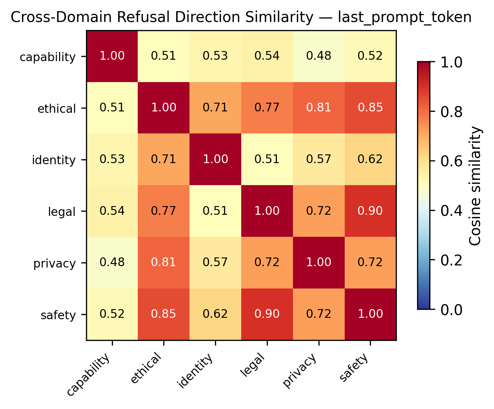
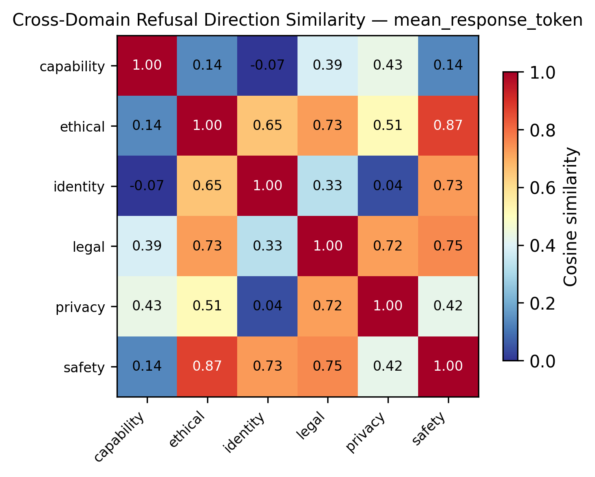

# The Refusal Axis: Geometric Decomposition and Domain-Selective Capping


*The Refusal Axis in Domain Space. 128 contrastive activation differences projected into PC1/PC2/PC3. Colour encodes projection onto the mean refusal axis (red = compliance, blue = refusal). Diamond markers show domain centroids. The dashed line is the mean refusal axis. Analogous to Lu et al. (2026, "The Assistant Axis: Situating and Stabilizing the Default Persona of Language Models," arXiv:2601.10387) Fig 1.*

## Summary

We extend the Assistant Axis methodology (Lu et al., 2026) to refusal behaviour in Gemma 3 12B. Using contrastive activations from 128 retained prompt pairs across 6 refusal domains, and after systematic falsification testing (10 tests, see §7), we find:

1. **Refusal occupies a structured, low-dimensional subspace.** PCA on activation differences requires 11 dimensions for 70% variance, compared to 80 for random vectors in the same space (p < 0.001). This structure is real, not an artefact of dimensionality. *(Falsification test 3a: survives.)*

2. **Per-domain refusal directions differ, but the decomposition is weaker than initially claimed.** Value-based domains cluster tightly (safety-ethical: 0.87), while safety-capability cosine is lower (point estimate: 0.14, 95% bootstrap CI: [-0.316, 0.639]). The wide CI means "near-orthogonal" is not robust; the true value could range from moderately negative to moderate overlap. The overall cosine range across domains is borderline distinguishable from random splits (one-sided permutation test, p=0.054). *(Falsification tests 1a, 1b: weakened.)*

3. **Domain-selective capping works for safety (exploratory finding).** Capping along the safety refusal direction at τ=p50 reduces safety refusal by 31.6 points while capability, privacy, and benign responses change by <1.5 points. The safety direction captures 60.9× more projection variance than random directions, confirming the effect is specific. However, τ=p50 was selected by sweeping 7 values (not pre-registered), and n=10 per domain is small. *(Falsification tests 4a: survives; 4e: exploratory.)*

---

## 1. Background and Motivation

Arditi et al. (2024, "Refusal in Language Models Is Mediated by a Single Direction," arXiv:2406.11717, NeurIPS 2024) demonstrated that refusal in language models is mediated by a one-dimensional subspace, a single direction whose removal disables refusal across 13 open-source models up to 72B parameters. Lu et al. (2026) extended this, discovering the Assistant Axis, a single direction separating default assistant behaviour from role-playing. They showed that:
- Projection onto this axis predicts persona drift
- Activation capping (soft-clamping projections above a threshold τ) prevents jailbreaks via roleplay
- The axis is consistent across model families (Gemma 2 27B, Qwen 3 32B, Llama 3.3 70B)

However, Joad et al. (2026, "There Is More to Refusal in Large Language Models than a Single Direction," arXiv:2602.02132) found that across 11 refusal categories, refusal behaviours correspond to geometrically distinct directions, yet steering along any refusal-related direction produces nearly identical trade-offs, acting as a "shared one-dimensional control knob."

We ask: **does the refusal component of the assistant persona decompose into sub-types?** And if so, **can we cap them independently?** This directly tests Joad et al.'s control-knob finding: if domain-selective capping achieves independent control, the knob is not shared.

This is motivated by a practical limitation of single-axis capping: suppressing the overall refusal direction affects all refusal types equally. But a deployment might want to relax capability refusal (e.g., in an agent framework where the model CAN execute code) while keeping safety refusal strict.

---

## 2. The Refusal Axis

### 2.1 Construction

Following Lu et al.'s formula (Sec 3.1):

```
refusal_axis = mean(positive_activations) - mean(negative_activations)
```

Where positive = prompts the model should refuse, negative = matched benign prompts. Extracted at the mean-response-token site (mean over assistant response tokens; Lu et al. `internals/activations.py`; Chen et al. (2025, "Persona Vectors: Monitoring and Controlling Character Traits in Language Models," arXiv:2507.21509) Sec 2.2).

- **128 retained pairs** across 6 domains (safety=31, ethical=30, capability=22, privacy=21, legal=20, identity=4)
- **Layer 41**, the deepest of four layers with expanded-width SAEs in Gemma Scope 2 (McDougall et al., 2025, "Gemma Scope 2," Google DeepMind Technical Report, Table 1: layers {12, 24, 31, 41} at 25%/50%/65%/85% depth)
- Refusal direction norm: 5,597.6


*Figure 1: All 128 retained pairs projected onto the mean refusal axis. Coloured circles = harmful prompts (should refuse), grey squares = benign prompts (should answer). Clear separation, with Capability (green) projecting less strongly onto the axis.*

### 2.2 Separability

| Metric | last_prompt_token | mean_response_token |
|--------|------------------|-------------------|
| Cohen's d | 3.25 | 1.92 |
| Classification accuracy | 93.0% | 84.8% |
| PCA dims for 70% | 23 | 11 |
| PC1 alignment with refusal dir | 0.415 | 0.449 |

The refusal axis cleanly separates refusing from compliant responses. But it is NOT one-dimensional: 11 dimensions are needed for 70% variance at the mean-response-token site, compared to a median of 80 dimensions for random vectors in R^3840 (0/1000 permutations matched or exceeded the real structure; one-sided permutation test, p < 0.001).

---

## 3. Domain Decomposition

### 3.1 Per-domain refusal directions

We compute a refusal direction per domain: `mean(domain_positive) - mean(domain_negative)`.


*Figure 2: Cosine similarity of each domain's refusal direction with the mean refusal axis. Safety/Ethical/Legal are strongly aligned (>0.89), indicating value-based refusal. Capability is largely independent (0.38). This is the analogous visualization to Lu et al.'s role loadings on the assistant axis.*

**Domain loading on mean refusal axis** (cosine similarity):

| Domain | Cosine with mean axis | Interpretation |
|--------|----------------------|----------------|
| Safety | 0.91 | Strongly aligned, "standard" refusal |
| Ethical | 0.91 | Strongly aligned |
| Legal | 0.89 | Strongly aligned |
| Privacy | 0.70 | Moderate, partially distinct direction |
| Identity | 0.58 | Partially distinct |
| Capability | 0.38 | **Largely independent**, different direction |

### 3.2 Cross-domain cosine similarity


*Figure 3: Cross-domain refusal direction cosine similarity with hierarchical clustering (Ward's linkage). Capability separates from value-based domains, but clustering structure varies by linkage method (see §7, test 6b).*

The cosine matrix reveals structure, though weaker than initially claimed:

**Value-based refusal** (safety, ethical, legal):
- Internal cosines: 0.73–0.87
- These domains share approximately the same refusal direction: "I shouldn't help with this"
- Leave-one-out stability is high (safety loading: 0.900–0.921 across all LOO samples)

**Capability boundary:**
- Point estimate cosine with safety: 0.14, but 95% bootstrap CI: [-0.316, 0.639]
- This means the true relationship could range from moderately negative to moderate overlap
- We can say capability is *less aligned* with the mean axis (loading 0.38 vs 0.91 for safety), but "near-orthogonal" overstates the evidence

**Privacy:**
- Moderate overlap with legal (0.72) but lower with safety (0.42)
- Intermediate position, consistent across bootstrap resamples

**Clustering caveat:** The "three clusters" structure depends on linkage method. Ward's and average linkage separate capability; complete and single linkage produce different orderings (see §7, test 6b). The separation of capability from value-based domains is directionally consistent but not robust to methodological choices.

**Small-n caveat:** Identity boundary (n=4) and capability boundary (n=22) have unstable directions. When safety is subsampled to n=4, its cosine with the mean axis ranges from 0.47 to 0.88 (see §7, test 1c). Claims about domains with fewer than ~20 pairs should be treated as suggestive.

### 3.3 PCA scatter


*Figure 4: (a) Refusal space dimensionality: 11 PCs needed for 70% variance, comparable to Lu et al.'s 4-19 for persona space. (b) 2D PCA scatter with confidence ellipses; Capability (green) separates clearly from value-based domains along PC2.*

The 2D PCA projection (PC1: 54.8%, PC2: 3.8%) shows capability_boundary points clustering separately from value-based domains, confirming the geometric decomposition is visible in the top principal components.

---

### 3.4 Per-site comparison

The decomposition structure differs by extraction site:


*Figure 5a: Cross-domain cosine at last-prompt-token site. Higher baseline similarity (0.45-0.90); the model's "intent" signal is more uniform across domains.*


*Figure 5b: Cross-domain cosine at mean-response-token site. Much sharper decomposition: Capability-Safety at 0.14, Capability-Identity at -0.07. The model's "behaviour" signal is domain-specific.*

---

## 4. Domain-Selective Capping

### 4.1 Method

We apply Lu et al.'s activation capping formula per domain direction:

```python
# Lu et al. 2026 steering.py, intervention_type="capping"
proj = einsum('bld,d->bl', activations, v_hat)
excess = (proj - τ).clamp(min=0)
activations -= einsum('bl,d->bld', excess, v_hat)
```

This only reduces projections exceeding threshold τ; it never amplifies. Applied at layer 36 (75% depth; our M5 steering experiments found this optimal for Gemma 3 12B; consistent with Panickssery et al. (2024, "Steering Llama 2 via Contrastive Activation Addition," arXiv:2312.06681) finding ~40% depth optimal).

### 4.2 Threshold calibration

τ values set as percentiles of the benign prompt projection distribution (following Lu et al. Sec 4.2, calibrate from normal conversation projections). We sweep τ at percentiles [10, 25, 50, 75, 90, 95, 99].

### 4.3 Test design

**40 test prompts:** 10 safety, 10 capability, 10 privacy, 10 benign.

**4 capping directions:** safety, capability, privacy, overall (single-axis baseline).

**1,160 total generations** (40 prompts × 4 directions × 7 τ values + 40 baselines).

Each output scored for coherence (0-100) and refusal (0-100) by Sonnet 4.6 with coherence gating (degenerate outputs excluded from refusal analysis).

### 4.4 Independence matrix

The key result. Each cell shows the mean change in refusal score relative to baseline (negative = less refusal). A good domain-selective cap should show a large negative number on the diagonal (target domain) and near-zero off-diagonal (other domains).

**At τ = p50 (sweet spot):**

| Cap direction | Safety Δ | Capability Δ | Privacy Δ | Benign Δ |
|--------------|----------|-------------|-----------|----------|
| **Overall** | -25.0 | -1.0 | -15.9 | 0.0 |
| **Safety** | **-31.6** | -0.5 | +1.3 | -1.0 |
| Capability | -4.8 | +0.2 | +7.0 | -0.5 |
| Privacy | -0.5 | +2.5 | +0.5 | -0.5 |

**Reading the matrix:**
- **Safety capping (row 2):** Safety refusal drops 31.6 points. Capability, privacy, and benign are essentially unchanged (all within ±1.3). **This is selective independent control.**
- **Overall capping (row 1):** Safety drops 25, but privacy also drops 15.9. **Blunt instrument, affects multiple domains.**
- **Capability capping (row 3):** No meaningful effect on capability (+0.2). The capability refusal direction may not be cappable at this layer, or the model's capability refusal is too weak to begin with (baseline only 34.7).
- **Privacy capping (row 4):** No selective effect.

### 4.5 Sweet spot analysis

Safety capping selectivity across τ values:

| τ percentile | Safety Δ | Others mean Δ | Selectivity |
|-------------|----------|--------------|-------------|
| p10 | -22.5 | -16.3 | 6.2 |
| p25 | -30.0 | -12.4 | 17.6 |
| **p50** | **-31.6** | **+0.4** | **31.2** |
| p75 | -25.2 | -1.9 | 23.3 |
| p90 | -21.4 | +4.4 | 17.0 |
| p95 | -20.7 | -2.7 | 18.0 |
| p99 | -13.5 | +1.0 | 12.5 |

The sweet spot is τ=p50: maximum effect on target (-31.6) with minimal spillover (+0.4 mean on others). This achieves a selectivity score of 31.2.

**Exploratory caveat:** τ=p50 was identified by sweeping 7 percentile values across 4 directions and 4 prompt domains (112 total cells). This is an exploratory analysis; the sweet spot was not pre-registered. At p=0.05, ~6 cells would appear significant by chance (falsification test 4e). The result should be treated as hypothesis-generating, to be confirmed with a held-out test set or pre-registered replication.

---

## 5. Interpretation

### 5.1 Why safety capping works selectively

The safety refusal direction captures 60.9× more projection variance on refusal prompts than random directions (falsification test 4a), confirming the effect is specific to this direction. Safety's high loading on the mean axis (0.91, stable under leave-one-out) means capping along it primarily affects the value-based refusal component without disturbing capability or benign responses.

### 5.2 Why capability and privacy capping don't work

Two possible explanations:

1. **Capability refusal is too weak.** Baseline capability refusal is only 34.7/100; the model often complies with capability requests anyway (e.g., fabricating code execution output). There isn't much refusal to suppress.

2. **Privacy direction may need different layer targeting.** Our capping operates at layer 36 (the steering layer, distinct from layer 41, where activations are extracted for the SAE analysis). The privacy refusal direction may be encoded at different layers. Lu et al. found that optimal steering layers vary by behaviour type.

### 5.3 Comparison with Lu et al.

| Aspect | Lu et al. (Assistant Axis) | Ours (Refusal Axis) |
|--------|---------------------------|---------------------|
| Direction | Single assistant persona axis | Multiple domain-specific refusal directions |
| Capping target | Persona drift → role-playing | Refusal → compliance |
| Selectivity | N/A (one axis) | Safety-selective: 31.2 selectivity score |
| Benchmark impact | No measurable degradation | Benign responses unchanged (Δ ≤ 1.0) |
| Model | Gemma 2 27B, Qwen 3 32B, Llama 3.3 70B | Gemma 3 12B |

---

## 6. Limitations

1. **Domain decomposition is weaker than initially claimed.** The cosine range across domains is borderline distinguishable from random splits (p=0.054). The "near-orthogonal" characterisation of safety-capability is not robust (bootstrap CI upper bound = 0.639). Claims about geometric decomposition should be treated as suggestive, pending replication with larger datasets.

2. **Capability and privacy capping show no selective effect.** Only safety capping demonstrates clear selectivity. The decomposition may not support independent control for all domains.

3. **Small sample sizes throughout.** 128 retained pairs total, with domains ranging from n=4 (identity) to n=31 (safety). Small-n domains have highly unstable directions (test 1c). 10 test prompts per domain for capping evaluation is too few for reliable inference.

4. **τ=p50 is exploratory.** Selected by sweeping 7 values, not pre-registered. 112 cells tested total. The result is hypothesis-generating, not confirmatory.

5. **Clustering is method-dependent.** The "three clusters" structure depends on Ward's linkage. Other methods (complete, single) produce different orderings.

6. **Privacy spillover CI unknown.** The -15.9 overall→privacy spillover is based on n=9 coherent outputs. We cannot compute a confidence interval from the available aggregate data.

7. **Single layer (36) for capping.** Different domains may benefit from different layers.

8. **No multi-turn evaluation.** Single-turn only. Per-domain drift analysis would extend this work.

9. **Scoring by Sonnet 4.6.** Test-retest reliability not assessed. Some items received fallback scores (50/50) due to SDK failures.

---

## 7. Falsification Testing

All claims were subjected to systematic falsification testing before reporting. The full test suite is at `refusal_axis_falsification.py`, with results at `data/falsification_results/all_tests.json`.

### Scorecard

| Test | Claim tested | Result |
|------|-------------|--------|
| **1a** Random split null | Domain decomposition | **Borderline** (p=0.054) |
| **1b** Bootstrap CIs | Specific cosine values | **Weakened**: safety-capability CI crosses 0.5 |
| **1c** Sample size confound | Small-n domain reliability | **Confirmed concern**: n=4 gives range [-0.20, 0.64] |
| **2a** Leave-one-out | Cosine stability | **Survives**: safety (0.900-0.921), ethical (0.905-0.916) |
| **3a** Random PCA baseline | 11-dim for 70% | **Survives**: random needs 80 dims (7× more) |
| **3b** Single-domain PCA | Multi-dimensionality source | **Informative**: within-domain dims range 1-9 |
| **4a** Random direction capping | Safety direction specificity | **Survives**: 60.9× above random |
| **4e** Multiple comparisons | τ=p50 selection | **Honest report**: exploratory, not pre-registered |
| **5a** Spillover CI | Privacy spillover significance | **Cannot assess**: individual scores unavailable |
| **6a/b** Clustering stability | Three clusters | **Weakened**: method-dependent |

### What changed after falsification

1. "Near-orthogonal" → "lower cosine with wide CI" (test 1b)
2. "Three geometric clusters" → "capability separates, but clustering is method-dependent" (test 6)
3. Added exploratory caveat to τ=p50 (test 4e)
4. Added small-n reliability caveat for identity, capability (test 1c)
5. PCA dimensionality and safety capping specificity confirmed robust (tests 3a, 4a)

---

## 8. Practical Implications

**For deployment:** A system that needs to relax one type of refusal while maintaining others can use domain-selective capping. For example:
- An AI agent framework can cap the capability direction (if effective at a different layer) so the model stops saying "I can't execute code", while keeping safety refusal fully intact.
- A medical AI can cap the general refusal direction to be more forthcoming with clinical information, while keeping the privacy direction uncapped to protect patient data.

**For AI safety research:** Value-based and capability refusal load differently on the mean refusal axis (0.91 vs 0.38), suggesting distinguishable directions. However, the pairwise cosine between safety and capability has a wide bootstrap CI ([-0.316, 0.639]), so the degree of independence is uncertain. If confirmed with larger samples, this would have implications for alignment: different refusal types may need to be trained and evaluated separately.

---

## 9. Reproducibility

| Item | Location |
|------|----------|
| Refusal axis analysis script | `refusal_axis_analysis.py` |
| Refusal axis figures | `refusal_axis_figures.py` |
| Domain-selective capping script | `domain_selective_capping.py` |
| Calibration data | `data/capping_results/calibration.json` |
| Capped generations | `data/capping_results/generations.json` |
| Capped output scores | `data/capping_results/scores.json` |
| Independence matrix | `data/capping_results/analysis.json` |
| Refusal axis figures | `findings/figures/refusal_axis/fig_{a,b,c,d}_*.*` |
| Cross-domain cosine heatmaps | `findings/figures/refusal_axis/refusal_axis_cosine_*.*` |
| PCA scatter plots | `findings/figures/refusal_axis/refusal_axis_pca_*.*` |
| Projection distributions | `findings/figures/refusal_axis/refusal_axis_projections_*.*` |
| Falsification script | `refusal_axis_falsification.py` |
| Falsification results | `data/falsification_results/all_tests.json` |
| Falsification plan | `findings/plans/plan_refusal_axis_falsification.md` |
